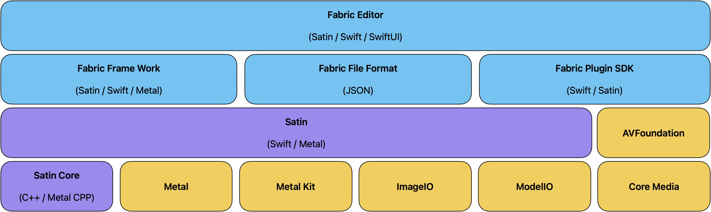

Fabric is a spiritual successor to Quartz Composer.

Fabric is built on top of Satin, providing a modern Metal graphics acceleration engine along with a scene graph. 

Fabric aims to provide:

* A node based editor UI
* An interchange composition format
* An SDK and runtime to host, load, and procedurally interact with Fabric composition documents other host apps.
* A plugin SDK to extend Fabric functionality

Fabric is very work in progress. 

Follow along on [our Git Repo](https://github.com/Fabric-Project/Fabric).

