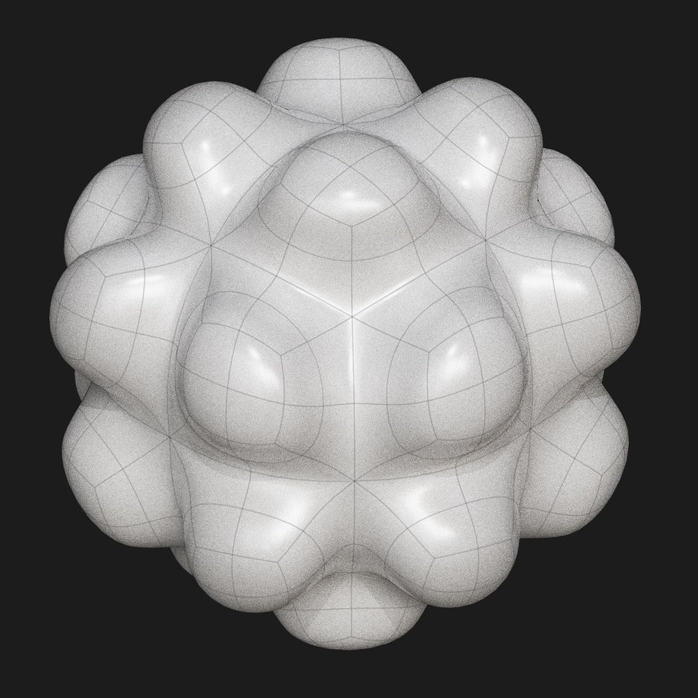
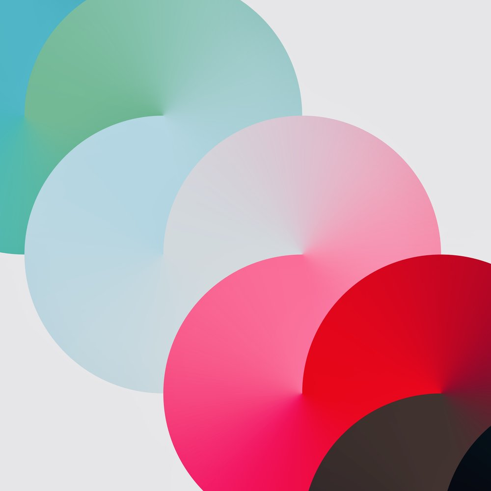
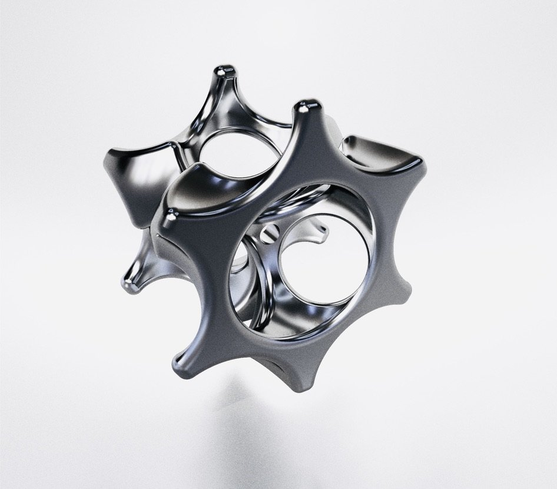
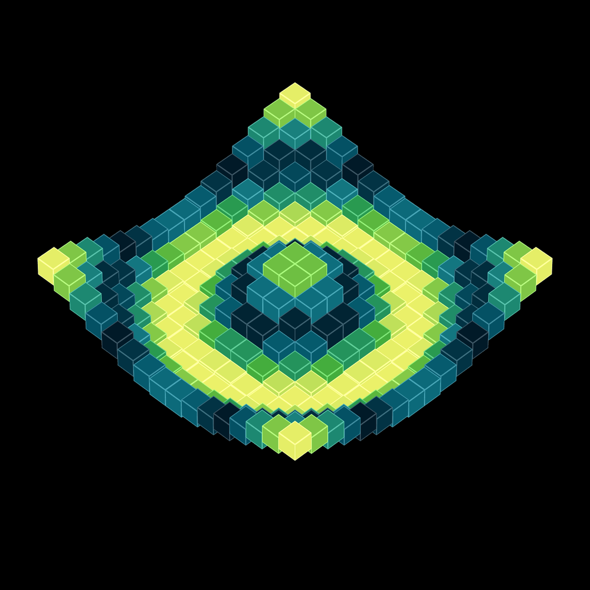
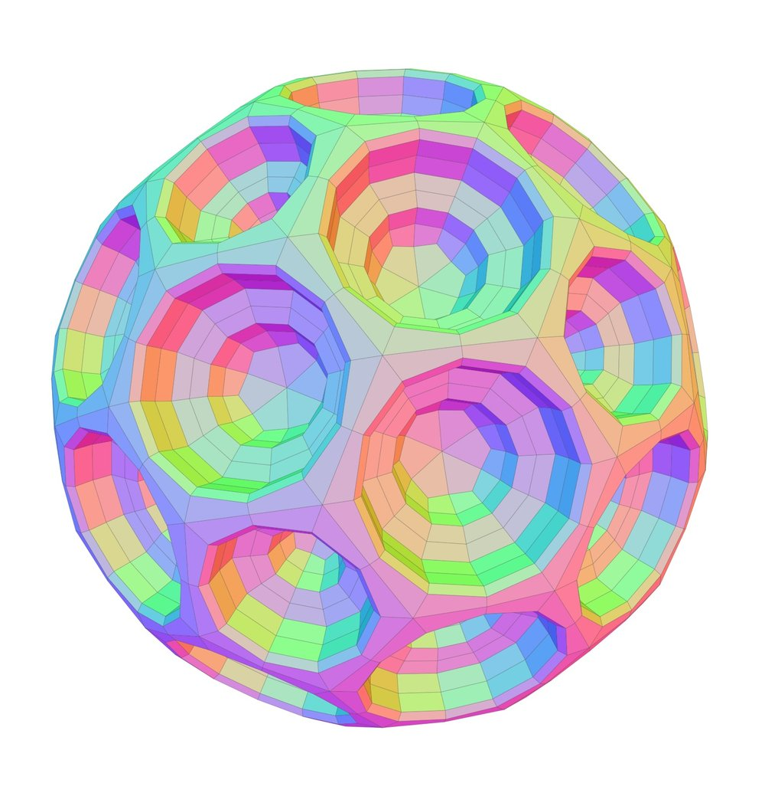
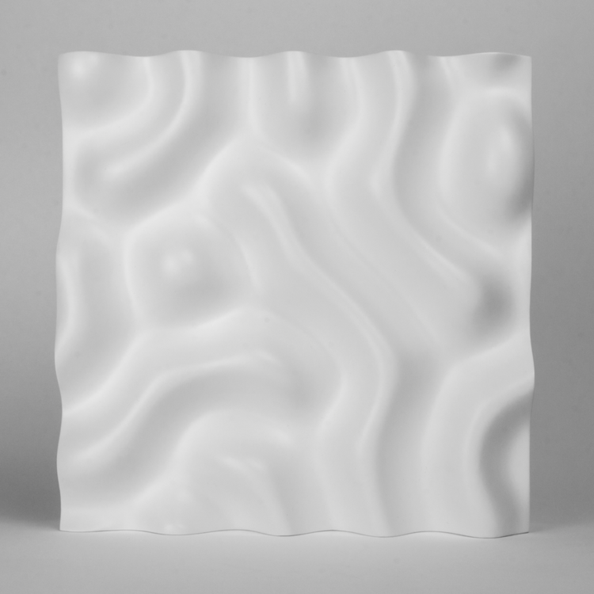
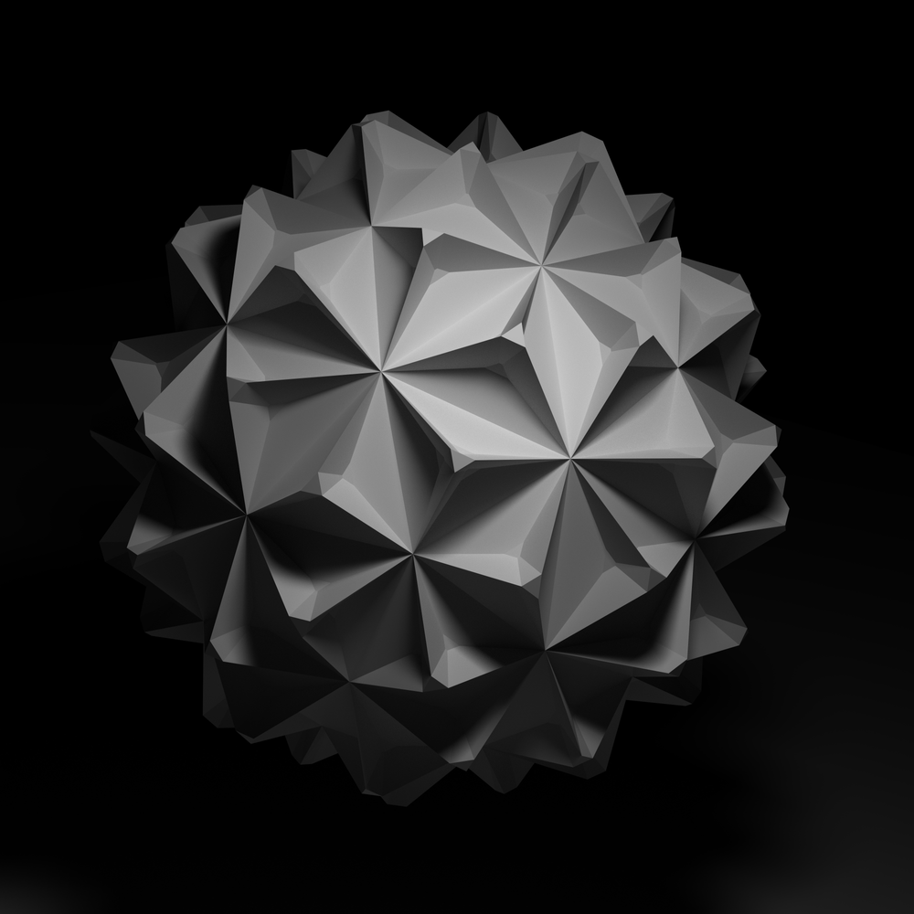
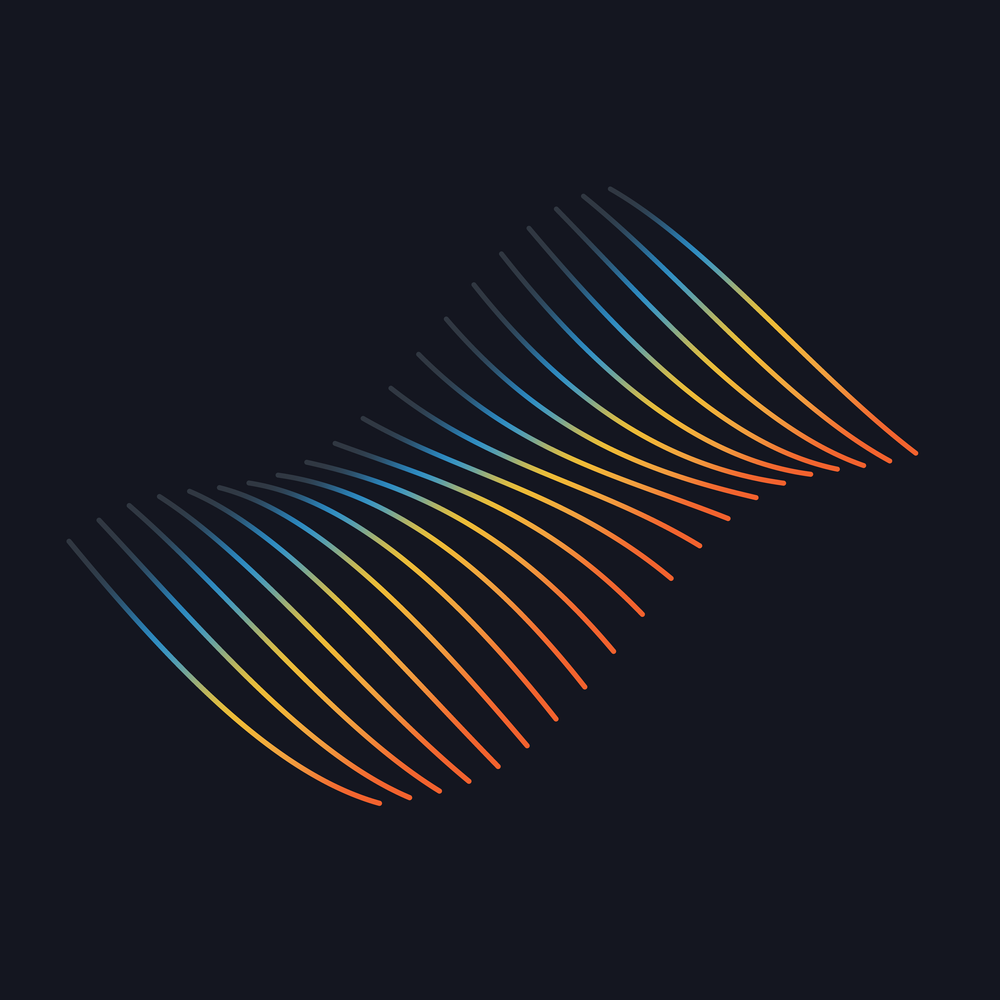

The Fabric project is the new community home for Satin - a Metal GPU rendering engine for Apple platforms written by [Reza Ali](http://github.com/rezaali). 

Fabric also hosts additional community projects, documentations and samples that use Satin.  [Read more about Satin's origins on Reza's portfolio site](https://www.syedrezaali.com/#/satin/) 

Satin images courtesy of [Reza Ali](http://github.com/rezaali)

